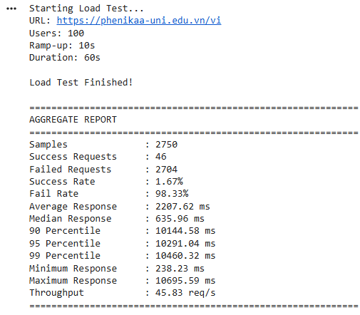
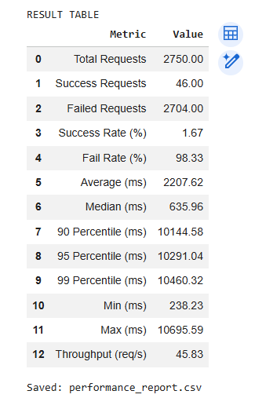
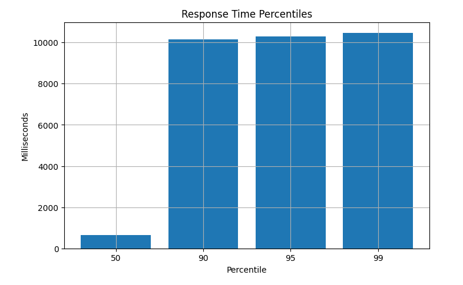

# BÁO CÁO KIỂM THỬ HIỆU NĂNG WEBSITE PHENIKAA

## 1. Mục tiêu

Thực hiện kiểm thử hiệu năng website:

> https://phenikaa-uni.edu.vn/vi

Mục đích của bài thực hành:

* Đánh giá khả năng đáp ứng của website khi có nhiều người dùng truy cập đồng thời.
* Đo thời gian phản hồi của hệ thống.
* Xác định tỷ lệ yêu cầu thành công và thất bại.
* Đánh giá khả năng chịu tải của website.

---

## 2. Môi trường kiểm thử

### Công cụ sử dụng

* Google Colab "https://colab.research.google.com/drive/1cxayZnG8WX1Pf1zGCOebMmhA2glblPno?usp=sharing"
* Python
* Requests
* Threading
* Matplotlib
* Pandas

### Cấu hình kiểm thử

| Thông số           | Giá trị                        |
| ------------------ | ------------------------------ |
| URL                | https://phenikaa-uni.edu.vn/vi |
| Số lượng User      | 100                            |
| Ramp-up Period     | 10 giây                        |
| Thời gian kiểm thử | 60 giây                        |
| Phương thức        | GET                            |
| Timeout            | 10 giây                        |

---

## 3. Kết quả kiểm thử

### Aggregate Report

| Chỉ số           | Giá trị     |
| ---------------- | ----------- |
| Samples          | 2750        |
| Success Requests | 46          |
| Failed Requests  | 2704        |
| Success Rate     | 1.67%       |
| Fail Rate        | 98.33%      |
| Average Response | 2207.62 ms  |
| Median Response  | 635.96 ms   |
| 90 Percentile    | 10144.58 ms |
| 95 Percentile    | 10291.04 ms |
| 99 Percentile    | 10460.32 ms |
| Min Response     | 238.23 ms   |
| Max Response     | 10695.59 ms |
| Throughput       | 45.83 req/s |

### Hình 1. Kết quả Aggregate Report



---

## 4. Phân tích kết quả

### 4.1 Tỷ lệ thành công và thất bại

Tổng cộng hệ thống gửi:

**2750 yêu cầu**

Trong đó:

* Thành công: 46 yêu cầu
* Thất bại: 2704 yêu cầu

Tỷ lệ thành công:

```text
46 / 2750 × 100 = 1.67%
```

Tỷ lệ thất bại:

```text
2704 / 2750 × 100 = 98.33%
```

Kết quả cho thấy phần lớn các yêu cầu không được xử lý thành công khi hệ thống chịu tải cao.

---

### 4.2 Thời gian phản hồi

Các chỉ số thời gian phản hồi:

| Chỉ số  | Giá trị     |
| ------- | ----------- |
| Average | 2207.62 ms  |
| Median  | 635.96 ms   |
| P90     | 10144.58 ms |
| P95     | 10291.04 ms |
| P99     | 10460.32 ms |

Nhận xét:

* Thời gian phản hồi trung vị chỉ khoảng 636 ms.
* Tuy nhiên nhiều yêu cầu bị chậm nghiêm trọng.
* 90% yêu cầu hoàn thành trong khoảng dưới 10.14 giây.
* Một số lượng lớn request chạm ngưỡng timeout 10 giây.

---

### 4.3 Throughput

Thông lượng đạt:

```text
45.83 request/giây
```

Điều này cho thấy máy chủ vẫn tiếp nhận được số lượng lớn yêu cầu trong thời gian ngắn.

Tuy nhiên tỷ lệ lỗi rất cao nên khả năng xử lý thực tế chưa đạt yêu cầu.

---

## 5. Phân tích biểu đồ

### 5.1 Biểu đồ phân bố thời gian phản hồi



Nhận xét:

* Phần lớn yêu cầu tập trung trong khoảng từ 200 ms đến 1000 ms.
* Xuất hiện một cụm dữ liệu lớn tại khoảng 10 giây.
* Điều này cho thấy nhiều yêu cầu đã bị timeout hoặc xử lý rất chậm.

---

### 5.2 Biểu đồ Percentile



Nhận xét:

* Percentile 90, 95 và 99 đều xấp xỉ 10 giây.
* Khoảng cách lớn giữa Median và P90 cho thấy hiệu năng không ổn định khi tải tăng cao.
* Hệ thống xuất hiện hiện tượng nghẽn hoặc giới hạn kết nối.

---

## 6. Nguyên nhân có thể

Một số nguyên nhân dẫn tới tỷ lệ lỗi cao:

* Website có cơ chế chống bot hoặc chống DDOS.
* Máy chủ giới hạn số lượng kết nối từ cùng một địa chỉ IP.
* Google Colab gửi nhiều request đồng thời khiến website từ chối truy cập.
* Máy chủ chưa được tối ưu cho tải 100 người dùng đồng thời.
* Nhiều request vượt quá thời gian timeout 10 giây.

---

## 7. Kết luận

Qua quá trình kiểm thử với 100 người dùng đồng thời trong thời gian 60 giây, hệ thống đã tiếp nhận tổng cộng 2750 yêu cầu với throughput đạt 45.83 request/giây.

Tuy nhiên chỉ có 46 yêu cầu thành công, tương ứng tỷ lệ thành công 1.67%, trong khi tỷ lệ thất bại lên tới 98.33%.

Ngoài ra các chỉ số Percentile 90, 95 và 99 đều vượt quá 10 giây, cho thấy hệ thống gặp khó khăn khi xử lý tải lớn hoặc đã kích hoạt cơ chế giới hạn truy cập tự động.

Từ kết quả trên có thể kết luận rằng website chưa đáp ứng tốt bài kiểm thử tải 100 người dùng đồng thời trong điều kiện thực nghiệm hiện tại. Để đánh giá chính xác hơn cần thực hiện kiểm thử bằng các công cụ chuyên dụng như Apache JMeter trên môi trường mạng ổn định và được kiểm soát tốt hơn.
